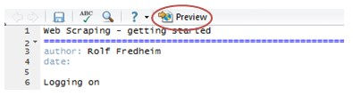
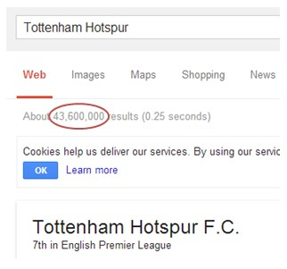
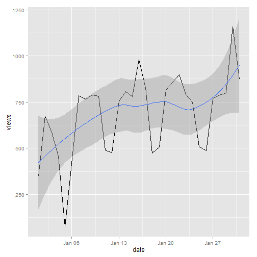

Web Scraping - getting started
========================================================
width: 1200
author: Rolf Fredheim
date: University of Cambridge
18/02/2014

Logging on
========================================================
type: s1

Before you sit down:
- Do you have your MCS password?
- Do you have your Raven password?
  - If you answered **'no'** to either then GO TO University Computing Services (just outside the door)NOW!
- Are you registered? If not, see me!

Open the presentation
========================================================
- **download these slides from  https://github.com/fredheir/WebScraping**
  - Open the file **p1.Rpres** in RStudio, and press **preview** to view the slides
  


for more info about editing these slides, go [here](http://www.rstudio.com/ide/docs/presentations/overview)

What will we do today?
==============
We will write a function that downloads Wikipedia page views, and returns this data in a format easy to process:


```r
#  require(ggplot2)
#  source("fetchdata.r")
#  a <- fetchData(1,c("Web_scraping","Data_mining"))
#   print(head(a))
# ```
# ***
# ```{r}
#  a$date <- as.Date(a$date)
#  ggplot(a,aes(date,rd.views,colour=target))+geom_line()

```


What will we learn?
====================
1) manipulating URLs

2) downloading stuff from within R

3) automate collection through loops and functions

What is 'Web Scraping'?
========================================================
From [Wikipedia](http://en.wikipedia.org/wiki/Web_scraping)
> Web scraping (web harvesting or web data extraction) is a computer software technique of extracting information from websites.


When might this be useful? (your examples)

- 
- 
- 
- 

Imposing structure on data
=========
Again, from [Wikipedia](http://en.wikipedia.org/wiki/Web_scraping)
> ... Web scraping focuses on the **transformation of unstructured data** on the web, typically in HTML format, into structured data that can be stored and analyzed in **a central local database or spreadsheet**. 

With structured data we can do all sorts of exciting things; these will vary from person to person. In my work I have used time-series analyses, network analyses, (linear) regression, etc. 

Example
=======
Approximate number of web pages



Tabulate this data
======


```r
require (ggplot2)
clubs <- c("Tottenham","Arsenal","Liverpool",
           "Everton","ManU","ManC","Chelsea")
nPages <- c(23.3,68.4,78.9,35.5,102,90.5,110)
df <- data.frame(clubs,nPages)
df
```

```
      clubs nPages
1 Tottenham   23.3
2   Arsenal   68.4
3 Liverpool   78.9
4   Everton   35.5
5      ManU  102.0
6      ManC   90.5
7   Chelsea  110.0
```


Visualise it
=======

```r
ggplot(df,aes(clubs,nPages,fill=clubs))+
  geom_bar(stat="identity")+
  coord_flip()+theme_bw(base_size=70)
```

 


Health and Safety
=====================
<p align="center"></p>

Programming with Humanists: Reflections on Raising an Army of Hacker-Scholars in the Digital Humanities
http://openbookpublishers.com/htmlreader/DHP/chap09.html#ch09

Bandwidth
=================
<p align="center"></p>


Practice
==============
type:section
- **The URL**
- Loops
- Scraping


The URL
=============

http://stats.grok.se/

http://stats.grok.se/en/201401/web_scraping

- en
- 201401
- web_scraping 

en.wikipedia.org/wiki/Web_scraping

Changes by hand
=====

http://stats.grok.se/en/201301/web_scraping
http://stats.grok.se/en/201402/web_scraping
http://stats.grok.se/en/201401/data_scraping


'this page is in json format'

The JSON data
==================

http://stats.grok.se/json/en/201401/web_scraping

{"daily_views": {"2013-01-12": 542, "2013-01-13": 593, "2013-01-10": 941, "2013-01-11": 798, "2013-01-16": 1119, "2013-01-17": 1124, "2013-01-14": 908, "2013-01-15": 1040, "2013-01-30": 1367, "2013-01-18": 1027, "2013-01-19": 743, "2013-01-31": 1151, "2013-01-29": 1210, "2013-01-28": 1130, "2013-01-23": 1275, "2013-01-22": 1131, "2013-01-21": 1008, "2013-01-20": 707, "2013-01-27": 789, "2013-01-26": 747, "2013-01-25": 1073, "2013-01-24": 1204, "2013-01-01": 379, "2013-01-03": 851, "2013-01-02": 807, "2013-01-05": 511, "2013-01-04": 818, "2013-01-07": 745, "2013-01-06": 469, "2013-01-09": 946, "2013-01-08": 912}, "project": "en", "month": "201301", "rank": -1, "title": "web_scraping"}


Paste
==================
Check out ?paste if you are unsure about this 

Bonus: check out ?paste0 for a timesaving bonus


```r
var=123
paste("url",var,sep="")
```

```
[1] "url123"
```

```r
paste("url",var,sep=" ")
```

```
[1] "url 123"
```


Paste2
==================

```r
var=123
paste("url",rep(var,3),sep="_")
```

```
[1] "url_123" "url_123" "url_123"
```

```r
paste(rep("url",3),var,sep="_")
```

```
[1] "url_123" "url_123" "url_123"
```

```r
paste("url",paste(rep(var,3),collapse="X"),sep="_")
```

```
[1] "url_123X123X123"
```


With a URL
===========================
type:sq

```r
var=201401
paste("http://stats.grok.se/json/en/",var,"/web_scraping")
```

```
[1] "http://stats.grok.se/json/en/ 201401 /web_scraping"
```

```r
paste("http://stats.grok.se/json/en/",var,"/web_scraping",sep="")
```

```
[1] "http://stats.grok.se/json/en/201401/web_scraping"
```


Task using 'paste'
==============
a="test"

b="scrape"

c=94

merge variables a,b,c into a string, separated by an underscore ("_")
> "test_scrape_94"

merge variables a,b,c into a string without any separating character
> "testscrape94"

print the letter 'a' followed by the numbers 1:10, without a separating character
> "a1"  "a2"  "a3"  "a4"  "a5"  "a6"  "a7"  "a8"  "a9"  "a10"


Questions
===================
type:section
1) how do we read the data from this page

2) how do we generate a list of links, say for the period 2012-2013?

Practice
==============
type:section

- The URL
- **Scraping**
- Loops

Testing a URL is correct in R
==============
Run this in your terminal:

var=201401

url=paste("http://stats.grok.se/json/en/",var,"/web_scraping",sep="")

url

browseURL(url)

Fetching data
==================

```r
require(rjson)
url=paste("http://stats.grok.se/json/en/",var,"/web_scraping",sep="")
raw.data <- readLines(url, warn="F") 
raw.data
```

```
[1] "{\"daily_views\": {\"2014-01-15\": 779, \"2014-01-14\": 806, \"2014-01-17\": 827, \"2014-01-16\": 981, \"2014-01-11\": 489, \"2014-01-10\": 782, \"2014-01-13\": 756, \"2014-01-12\": 476, \"2014-01-19\": 507, \"2014-01-18\": 473, \"2014-01-28\": 789, \"2014-01-29\": 799, \"2014-01-20\": 816, \"2014-01-21\": 857, \"2014-01-22\": 899, \"2014-01-23\": 792, \"2014-01-24\": 749, \"2014-01-25\": 508, \"2014-01-26\": 488, \"2014-01-27\": 769, \"2014-01-07\": 786, \"2014-01-04\": 456, \"2014-01-05\": 77, \"2014-01-02\": 674, \"2014-01-03\": 586, \"2014-01-01\": 348, \"2014-01-08\": 765, \"2014-01-09\": 787, \"2014-01-31\": 874, \"2014-01-30\": 1159}, \"project\": \"en\", \"month\": \"201401\", \"rank\": -1, \"title\": \"web_scraping\"}"
```


Fetching data2
==================

```r
rd  <- fromJSON(raw.data)
rd
```

```
$daily_views
$daily_views$`2014-01-15`
[1] 779

$daily_views$`2014-01-14`
[1] 806

$daily_views$`2014-01-17`
[1] 827

$daily_views$`2014-01-16`
[1] 981

$daily_views$`2014-01-11`
[1] 489

$daily_views$`2014-01-10`
[1] 782

$daily_views$`2014-01-13`
[1] 756

$daily_views$`2014-01-12`
[1] 476

$daily_views$`2014-01-19`
[1] 507

$daily_views$`2014-01-18`
[1] 473

$daily_views$`2014-01-28`
[1] 789

$daily_views$`2014-01-29`
[1] 799

$daily_views$`2014-01-20`
[1] 816

$daily_views$`2014-01-21`
[1] 857

$daily_views$`2014-01-22`
[1] 899

$daily_views$`2014-01-23`
[1] 792

$daily_views$`2014-01-24`
[1] 749

$daily_views$`2014-01-25`
[1] 508

$daily_views$`2014-01-26`
[1] 488

$daily_views$`2014-01-27`
[1] 769

$daily_views$`2014-01-07`
[1] 786

$daily_views$`2014-01-04`
[1] 456

$daily_views$`2014-01-05`
[1] 77

$daily_views$`2014-01-02`
[1] 674

$daily_views$`2014-01-03`
[1] 586

$daily_views$`2014-01-01`
[1] 348

$daily_views$`2014-01-08`
[1] 765

$daily_views$`2014-01-09`
[1] 787

$daily_views$`2014-01-31`
[1] 874

$daily_views$`2014-01-30`
[1] 1159


$project
[1] "en"

$month
[1] "201401"

$rank
[1] -1

$title
[1] "web_scraping"
```


Fetching data3
==================

```r
rd.views <- rd$daily_views 
rd.views
```

```
$`2014-01-15`
[1] 779

$`2014-01-14`
[1] 806

$`2014-01-17`
[1] 827

$`2014-01-16`
[1] 981

$`2014-01-11`
[1] 489

$`2014-01-10`
[1] 782

$`2014-01-13`
[1] 756

$`2014-01-12`
[1] 476

$`2014-01-19`
[1] 507

$`2014-01-18`
[1] 473

$`2014-01-28`
[1] 789

$`2014-01-29`
[1] 799

$`2014-01-20`
[1] 816

$`2014-01-21`
[1] 857

$`2014-01-22`
[1] 899

$`2014-01-23`
[1] 792

$`2014-01-24`
[1] 749

$`2014-01-25`
[1] 508

$`2014-01-26`
[1] 488

$`2014-01-27`
[1] 769

$`2014-01-07`
[1] 786

$`2014-01-04`
[1] 456

$`2014-01-05`
[1] 77

$`2014-01-02`
[1] 674

$`2014-01-03`
[1] 586

$`2014-01-01`
[1] 348

$`2014-01-08`
[1] 765

$`2014-01-09`
[1] 787

$`2014-01-31`
[1] 874

$`2014-01-30`
[1] 1159
```


Fetching data4
==================

```r
rd.views <- unlist(rd.views)
df <- as.data.frame(rd.views)
df
```

```
           rd.views
2014-01-15      779
2014-01-14      806
2014-01-17      827
2014-01-16      981
2014-01-11      489
2014-01-10      782
2014-01-13      756
2014-01-12      476
2014-01-19      507
2014-01-18      473
2014-01-28      789
2014-01-29      799
2014-01-20      816
2014-01-21      857
2014-01-22      899
2014-01-23      792
2014-01-24      749
2014-01-25      508
2014-01-26      488
2014-01-27      769
2014-01-07      786
2014-01-04      456
2014-01-05       77
2014-01-02      674
2014-01-03      586
2014-01-01      348
2014-01-08      765
2014-01-09      787
2014-01-31      874
2014-01-30     1159
```


Put it together
===================

```r
rd <- fromJSON(readLines(url, warn="F"))
rd.views <- rd$daily_views 
df <- as.data.frame(unlist(rd.views))
```


Plot it
=================

```r
require(ggplot2)
require(lubridate)
df$date <-  as.Date(rownames(df))
colnames(df) <- c("views","date")
ggplot(df,aes(date,views))+geom_line()+geom_smooth()
```

 


Tasks
====================
Make a plot of wikipedia page views in February 2014 for the Sochi games 


Moving on
=========================
If you are comfortable with loops and functions, go ahead and write a great application. 

The rest of us are going to learn about loops


Practice
==============
type:section
- The URL
- Scraping
- **Loops**


Briefly about functions
===============
type:sq

```r
plusOne <- function(x){ 
		return(x+1)			
	}

plusOne2 <- function(num){ 
		return(num+1)			
	}
```


<small> 
- Curly brackets {} include the code to be executed
- Normal brackets () contain a list of variables</small>

****

```r
	plusOne(8)
```

```
[1] 9
```

```r
	plusOne2(10)
```

```
[1] 11
```

```r
  plusOne2(num=5)
```

```
[1] 6
```

```r
  #plusOne2(wrongVar=2)
```


Vectors
=============

```r
a <- c(1,2,3,4,5) #Least flexible, fastest
a+1
```

```
[1] 2 3 4 5 6
```

```r
plusOne(a) #Quite flexible
```

```
[1] 2 3 4 5 6
```

```r
sapply(a,plusOne) #Can be used in all sorts of situations, slow - similar to a loop, better if you are colleting an output
```

```
[1] 2 3 4 5 6
```


Simple loops
=============

```r
for (number in 1:5){
	print (number)
}
```

```
[1] 1
[1] 2
[1] 3
[1] 4
[1] 5
```


Looping over functions
========================
type:sq

```r
a <- c(1,2,3,4,5)
for (value in a){
	print (
		plusOne(value)
	)
}
```

```
[1] 2
[1] 3
[1] 4
[1] 5
[1] 6
```

***

```r
listOfNumbers <- c(1,2,3,4,5)
for (number in listOfNumbers){
	print (
		number+1
	)
}
```

```
[1] 2
[1] 3
[1] 4
[1] 5
[1] 6
```


More loops
========================
type:sq

```r
a <- c(1,2,3,4,5)
a[1] #The first number in the vector
```

```
[1] 1
```

```r
a[4] #The fourth number in the vector
```

```
[1] 4
```

```r

for (i in 1:length(a)){
	print (
		plusOne(a[i])
	)
}
```

```
[1] 2
[1] 3
[1] 4
[1] 5
[1] 6
```


What are we looping over
=================
type:sq
In each case we are performing an operation on the vector in brackets. 

See:

```r
#for (i in 1:length(a))
print(1:length(a))
```

```
[1] 1 2 3 4 5
```

```r
#for (i in length(a))
print (length(a))
```

```
[1] 5
```

```r
#for (i in a)
print (a)
```

```
[1] 1 2 3 4 5
```


Urls again
==========
type:sq1

stats.grok.se/json/en/**201401**/web_scraping

```r
for (month in 1:12){
	print(paste(2014,month,sep=""))
}
```

```
[1] "20141"
[1] "20142"
[1] "20143"
[1] "20144"
[1] "20145"
[1] "20146"
[1] "20147"
[1] "20148"
[1] "20149"
[1] "201410"
[1] "201411"
[1] "201412"
```


Not quite right
================
type:sq
left:20
We need the variable 'month' to have two digits:

201401
***

```r
	for (month in 1:9){
		print(paste(2012,0,month,sep=""))
	}
```

```
[1] "201201"
[1] "201202"
[1] "201203"
[1] "201204"
[1] "201205"
[1] "201206"
[1] "201207"
[1] "201208"
[1] "201209"
```

```r

	for (month in 10:12){
		print(paste(2012,month,sep=""))
	}
```

```
[1] "201210"
[1] "201211"
[1] "201212"
```


Store the data
=========
type:sq
left:60

```r
dates=NULL
for (year in 2012:2013){
	for (month in 1:9){
		date=(paste(year,0,month,sep=""))
		dates=c(dates,date)
	}

	for (month in 10:12){
		date=(paste(year,month,sep=""))
		dates=c(dates,date)
	}
}
print (as.numeric(dates))
```

```
 [1] 201201 201202 201203 201204 201205 201206 201207 201208 201209 201210
[11] 201211 201212 201301 201302 201303 201304 201305 201306 201307 201308
[21] 201309 201310 201311 201312
```

***
here we concatenated the values:

```r
dates <- c(c(201201,201202),201203)
print (dates)
```

```
[1] 201201 201202 201203
```

!! To do this with a **data.frame**, use **rbind()**

Add another variable
=========================
type:sq
We might want years to be a variable
Shows two loops:

```r
for (year in 2012:2013){
	for (month in 1:9){
		print(paste(year,0,month,sep=""))
	}
	for (month in 10:12){
		print(paste(year,month,sep=""))
	}
}
```

```
[1] "201201"
[1] "201202"
[1] "201203"
[1] "201204"
[1] "201205"
[1] "201206"
[1] "201207"
[1] "201208"
[1] "201209"
[1] "201210"
[1] "201211"
[1] "201212"
[1] "201301"
[1] "201302"
[1] "201303"
[1] "201304"
[1] "201305"
[1] "201306"
[1] "201307"
[1] "201308"
[1] "201309"
[1] "201310"
[1] "201311"
[1] "201312"
```


Putting it together
============================
type:sq

http://stats.grok.se/json/en/201401/web_scraping

```r
for (year in 2012:2013){
	for (month in 1:9){
		print(paste("http://stats.grok.se/json/en/",year,0,month,"/web_scraping",sep=""))
	}

	for (month in 10:12){
		print(paste("http://stats.grok.se/json/en/",year,month,"/web_scraping",sep=""))
	}
}
```

```
[1] "http://stats.grok.se/json/en/201201/web_scraping"
[1] "http://stats.grok.se/json/en/201202/web_scraping"
[1] "http://stats.grok.se/json/en/201203/web_scraping"
[1] "http://stats.grok.se/json/en/201204/web_scraping"
[1] "http://stats.grok.se/json/en/201205/web_scraping"
[1] "http://stats.grok.se/json/en/201206/web_scraping"
[1] "http://stats.grok.se/json/en/201207/web_scraping"
[1] "http://stats.grok.se/json/en/201208/web_scraping"
[1] "http://stats.grok.se/json/en/201209/web_scraping"
[1] "http://stats.grok.se/json/en/201210/web_scraping"
[1] "http://stats.grok.se/json/en/201211/web_scraping"
[1] "http://stats.grok.se/json/en/201212/web_scraping"
[1] "http://stats.grok.se/json/en/201301/web_scraping"
[1] "http://stats.grok.se/json/en/201302/web_scraping"
[1] "http://stats.grok.se/json/en/201303/web_scraping"
[1] "http://stats.grok.se/json/en/201304/web_scraping"
[1] "http://stats.grok.se/json/en/201305/web_scraping"
[1] "http://stats.grok.se/json/en/201306/web_scraping"
[1] "http://stats.grok.se/json/en/201307/web_scraping"
[1] "http://stats.grok.se/json/en/201308/web_scraping"
[1] "http://stats.grok.se/json/en/201309/web_scraping"
[1] "http://stats.grok.se/json/en/201310/web_scraping"
[1] "http://stats.grok.se/json/en/201311/web_scraping"
[1] "http://stats.grok.se/json/en/201312/web_scraping"
```


Tasks about Loops
==================
- write a loop that prints every number between 1 and 1000
- write a loop that adds up all the numbers between 1 and 1000
- write a function that takes an input number and returns this number divided by two
- write a function that returns the value 99 no matter what the input
- write a function that takes two variables, and returns the sum of these variables

Advanced tasks
=========================
can you make an application which takes a wikipedia page (e.g. web_scraping) and returns a plot for the month 201312
Can you extend this application to plot data for the entire year 2013 (that is for pages 201301:201312)
Can you expand this further by going accross multiple years (201212:201301)
Can you write the application so that it takes a custom data range?

Getting started with functions
=============================


Reading
=============

http://www.bbc.co.uk/news/technology-23988890
http://blog.hartleybrody.com/web-scraping/
http://openbookpublishers.com/htmlreader/DHP/chap09.html#ch09
http://www.essex.ac.uk/ldev/documents/going_digital/scraping_book.pdf
https://software.rc.fas.harvard.edu/training/scraping2/latest/index.psp#(1) 
