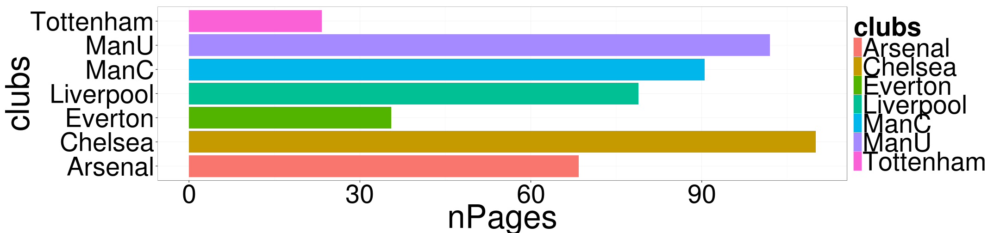

Digital Data Collection - getting started
========================================================
width: 1200
author: Rolf Fredheim and Yulia Shenderovich
date: University of Cambridge
font-family: 'Rockwell'
css:style.css

17/02/2015

Logging on
========================================================
type: s1

Before you sit down:
- Do you have your MCS password?
- Do you have your Raven password?
  - If you answered **'no'** to either then go to the University Computing Services (just outside the door) NOW!
- Are you registered? If not, see me!

Download these slides 
========================================================
type:sq2

Follow link from course description on the SSRMC pages or go directly to 
http://fredheir.github.io/WebScraping/

Download the R file to your computer

Optionally download the slides

And again, optionally open the html slides in your browser


Install the following packages:
===============
knitr
ggplot2
lubridate
plyr
jsonlite
stringr

press **preview** to view the slides in RStudio


Who is this course for
===============
<s>Computer scientists</s>

Anyone with some minimal background in coding and good computer literacy


By the end of the course you will have
==============
Created a system to extract text and numbers from a large number of web pages

Learnt to harvest links

Worked with an API to gather data, e.g. from YouTube

Convert messy data into tabular data


What will we need?
==============
A windows Computer

A modern browser - Chrome or Firefox

<s>~~An up to date version of Rstudio~~</s>


Getting help
============
- ?[functionName]
- StackOverflow
- Ask each other. 


Outline
========================================================
type:section

**Theory**

Practice


What is 'Web Scraping'?
========================================================
From [Wikipedia](http://en.wikipedia.org/wiki/Web_scraping)
> Web scraping (web harvesting or web data extraction) is a computer software technique of extracting information from websites.


When might this be useful? (your examples)

- 
- 
- 
- 

Imposing structure on data
=========
Again, from [Wikipedia](http://en.wikipedia.org/wiki/Web_scraping)
> ... Web scraping focuses on the **transformation of unstructured data** on the web, typically in HTML format, into structured data that can be stored and analyzed in **a central local database or spreadsheet**. 


What will we learn? 
====================
1) working with text in R

2) Connecting R to the outside world

3) Downloading from within R


Example
=======
Approximate number of web pages


Tabulate this data
======


```r
require (ggplot2)
clubs <- c("Tottenham","Arsenal","Liverpool",
           "Everton","ManU","ManC","Chelsea")
nPages <- c(67,113,54,16,108,93,64)
df <- data.frame(clubs,nPages)
df
```

```
      clubs nPages
1 Tottenham     67
2   Arsenal    113
3 Liverpool     54
4   Everton     16
5      ManU    108
6      ManC     93
7   Chelsea     64
```

Visualise it
=======

```r
ggplot(df,aes(clubs,nPages,fill=clubs))+
  geom_bar(stat="identity")+
  coord_flip()+theme_bw(base_size=70)
```

 

Health and Safety
=====================
<p align="center"></p>

Programming with Humanists: Reflections on Raising an Army of Hacker-Scholars in the Digital Humanities
http://openbookpublishers.com/htmlreader/DHP/chap09.html#ch09


Why might the Google example not be a good one?
=====================

Bandwidth
=================
<p align="center"></p>
***
> the agent machines (slave zombies) begin to send a large volume of packets to the victim, flooding its system with useless load and exhausting its resources.

source: cisco.com

We will not: 
- run parallel processes

we will:
- test code on minimal data

Practice
==============
type:section
- **String manipulation**
- Loops
- Scraping

The JSON data
==================

http://stats.grok.se/json/en/201401/web_scraping

{"daily_views": {"2013-01-12": 542, "2013-01-13": 593, "2013-01-10": 941, "2013-01-11": 798, "2013-01-16": 1119, "2013-01-17": 1124, "2013-01-14": 908, "2013-01-15": 1040, "2013-01-30": 1367, "2013-01-18": 1027, "2013-01-19": 743, "2013-01-31": 1151, "2013-01-29": 1210, "2013-01-28": 1130, "2013-01-23": 1275, "2013-01-22": 1131, "2013-01-21": 1008, "2013-01-20": 707, "2013-01-27": 789, "2013-01-26": 747, "2013-01-25": 1073, "2013-01-24": 1204, "2013-01-01": 379, "2013-01-03": 851, "2013-01-02": 807, "2013-01-05": 511, "2013-01-04": 818, "2013-01-07": 745, "2013-01-06": 469, "2013-01-09": 946, "2013-01-08": 912}, "project": "en", "month": "201301", "rank": -1, "title": "web_scraping"}


String manipulation in R
==============
type:sq2

Top string manipulation functions:
<small>
- tolower (also  toupper, capitalize)
- grep
- gsub
- str_split (library: stringr)
-substring
- paste and paste0
- nchar
- str_trim (library: stringr)
</small>

Reading: 
<small>
- http://en.wikibooks.org/wiki/R_Programming/Text_Processing
- http://chemicalstatistician.wordpress.com/2014/02/27/useful-functions-in-r-for-manipulating-text-data/
- http://gastonsanchez.com/blog/resources/how-to/2013/09/22/Handling-and-Processing-Strings-in-R.html
</small>


Changing the case
================
incremental:true
We can apply them to individual strings, or to vectors:

```r
tolower('ROLF')
```

```
[1] "rolf"
```

```r
states = rownames(USArrests)
tolower(states[0:4])
```

```
[1] "alabama"  "alaska"   "arizona"  "arkansas"
```

```r
toupper(states[0:4])
```

```
[1] "ALABAMA"  "ALASKA"   "ARIZONA"  "ARKANSAS"
```

Number of characters
================
incremental:true
We can also use this to make selections:

```r
nchar(states)
```

```
 [1]  7  6  7  8 10  8 11  8  7  7  6  5  8  7  4  6  8  9  5  8 13  8  9
[24] 11  8  7  8  6 13 10 10  8 14 12  4  8  6 12 12 14 12  9  5  4  7  8
[47] 10 13  9  7
```

```r
states[nchar(states)==5]
```

```
[1] "Idaho" "Maine" "Texas"
```


Cutting strings
============
We can use fixed positions, e.g. to get first character
m

or to get a fixed part of the string:
text

Can you see how this function works? If not use ?substring


str_split
==============
incremental:true
type:sq

- Manipulating URLs
- Editing time stamps, etc

- syntax: str_split(inputString,pattern)
returns a list

```r
require(stringr)
link="http://stats.grok.se/json/en/201401/web_scraping"
str_split(link,'/')
```

```
[[1]]
[1] "http:"         ""              "stats.grok.se" "json"         
[5] "en"            "201401"        "web_scraping" 
```

```r
unlist(str_split(link,"/"))
```

```
[1] "http:"         ""              "stats.grok.se" "json"         
[5] "en"            "201401"        "web_scraping" 
```

Cleaning data
============
type:sq1
incremental:true

- nchar
- tolower (also  toupper)
- str_trim (library: stringr)

```r
annoyingString <- "\n    something HERE  \t\t\t"
```
***

```r
nchar(annoyingString)
```

```
[1] 24
```

```r
str_trim(annoyingString)
```

```
[1] "something HERE"
```

```r
tolower(str_trim(annoyingString))
```

```
[1] "something here"
```

```r
nchar(str_trim(annoyingString))
```

```
[1] 14
```


Structured practice
===========
type:alert
Remember how to read in files using R? Load in some text from the web:
<small>

```r
require(RCurl)

download.file('https://raw.githubusercontent.com/fredheir/WebScraping/gh-pages/Lecture1_2015/text.txt',destfile='tmp.txt',method='curl')
text=readLines('tmp.txt')
```
- What is this? Explore the file. 
- How many lines does the file have?
- print only the seventh line. Use **str_split()** to break it up into individual words
- How many words are there? use **length()** to count the number of words. 
- Are any words used more than once? Use table to find out!
- Can you sort the results? 
- What are the 10 most common words?
- use nchar to find the length of the ten most common words? Tip: use **names()**
- What about for the whole text?
</small>

Walkthrough
=======
type:prompt
incremental:true


```r
length(text)
text[7]
length(unlist(str_split(text[7],' ')))
table(length(unlist(str_split(text[7],' '))))
words=sort(table(length(unlist(str_split(text[7],' ')))))
tail(words)
nchar(names(tail(words)))
words=sort(table(length(unlist(str_split(text,' ')))))
tail(words)
```

What do they do - grep
=====================
type:sq1
incremental:true
Grep allows regular expressions in R

E.g. 

```r
grep("Ohio",states)
```

```
[1] 35
```

```r
grep("y",states)
```

```
[1] 17 20 30 38 50
```

```r
#To make a selection
states[grep("y",states)]
```

```
[1] "Kentucky"     "Maryland"     "New Jersey"   "Pennsylvania"
[5] "Wyoming"     
```

Grep 2
============
type:sq

useful options: 
- invert=TRUE : get all non-matches
- ignore.case=TRUE : what it says on the box
- value = TRUE : return values rather than positions

Structured practice2
===========
type:alert
Use Grep to find all the statements including the words:
- 'London'
- 'conspiracy'
- 'amendment'

Each of the statements in our parliamentary debate begin with a paragraph sign(§)
- Use grep to select only these lines!
- How many separate statements are there? 


Walkthrough2
=======
incremental:true
type:prompt

```r
grep('London',text)
grep('conspiracy',text)
grep('amendment',text)
grep('§',text)
length(grep('§',text))
```

Regex
========
type:sq1
incremental:true

- ?regex 
- http://www.rexegg.com/regex-quickstart.html

Can match beginning or end of word, e.g.:

```r
stalinwords=c("stalin","stalingrad","Stalinism","destalinisation")
grep("stalin",stalinwords,value=T)

#Capitalisation
grep("stalin",stalinwords,value=T)
grep("[Ss]talin",stalinwords,value=T)

#Wildcards
grep("s*grad",stalinwords,value=T)

#beginning and end of word
grep('\\<d',stalinwords,value=T)
grep('d\\>',stalinwords,value=T)
```

Before running these on your computer, can you figure out what they will do?

Structured practice 3
===========
type:alert
Use grep to check whether you missed some hits for above due to capitalisation (London, conspiracy, amendment)

Use the caret(^ ) character to match the start of a line. How many lines start with the word 'Amendment'?

Use the dollar($) sign to match the end of a line. How many lines end with a question mark?


Walkthrough3
=======
type:prompt
incremental:true

```r
grep('[Aa]mendment',text)
```

```
[1]  6 40 41 43 53 55 61 63 65
```

```r
grep('^[Aa]mendment',text)
```

```
[1] 55 65
```

```r
grep('\\?$',text)
```

```
[1]  9 24 47 57 59 63
```


What do they do: gsub
=====================
incremental:true

```r
author <- "By Rolf Fredheim"
gsub("By ","",author)
```

```
[1] "Rolf Fredheim"
```

```r
gsub("Rolf Fredheim","Tom",author)
```

```
[1] "By Tom"
```

Gsub can also use regex


Outline
========================================================
type:section

Theory

**Practice**


Questions
===================
type:section
1) how do we read the data from this page
http://stats.grok.se/json/en/201401/web_scraping

2) how do we generate a list of links, say for the whole of 2013?

Practice
==============
type:section

- String manipulation
- **Scraping**
- Loops


The URL
=============

http://stats.grok.se/

http://stats.grok.se/en/201401/web_scraping

- en
- 201401
- web_scraping 

en.wikipedia.org/wiki/Web_scraping

Changes by hand
=====

http://stats.grok.se/en/201301/web_scraping
http://stats.grok.se/en/201402/web_scraping
http://stats.grok.se/en/201401/data_scraping


'this page is in json format'


Paste
==================
incremental:true
Check out ?paste if you are unsure about this 

Bonus: check out ?paste0


```r
var=123
paste("url",var,sep="")
```

```
[1] "url123"
```

```r
paste("url",var,sep=" ")
```

```
[1] "url 123"
```

Paste2
==================
incremental:true

```r
var=123
paste("url",rep(var,3),sep="_")
```

```
[1] "url_123" "url_123" "url_123"
```

Paste3
======
Can you figure out what these will print?

```r
paste("url",1:3,var,sep="_")
var=c(123,421)
paste(var,collapse="_")
```

With a URL
===========================
type:sq
incremental:true

```r
var=201401
paste("http://stats.grok.se/json/en/",var,"/web_scraping")
```

```
[1] "http://stats.grok.se/json/en/ 201401 /web_scraping"
```

```r
paste("http://stats.grok.se/json/en/",var,"/web_scraping",sep="")
```

```
[1] "http://stats.grok.se/json/en/201401/web_scraping"
```

Task using 'paste'
==============
type:alert
<small>
- a="test"
- b="scrape"
- c=94

merge variables a,b,c into a string, separated by an underscore ("_")
> "test_scrape_94"

merge variables a,b,c into a string without any separating character
> "testscrape94"

print the letter 'a' followed by the numbers 1:10, without a separating character 
> "a1"  "a2"  "a3"  "a4"  "a5"  "a6"  "a7"  "a8"  "a9"  "a10"
</small>

Walkthrough
===========
type:prompt

```r
a="test"
b="scrape"
c=94

paste(a,b,c,sep='_')
paste(a,b,c,sep='')
#OR:
paste0(a,b,c)
paste('a',1:10,sep='')
```

Testing a URL is correct in R
==============
type:sq1

Run this in your terminal:


```r
var=201401
url=paste("http://stats.grok.se/json/en/",var,"/web_scraping",sep="")
url
browseURL(url)
```

Fetching data
==================
type:sq1

```r
var=201401
url=paste("http://stats.grok.se/json/en/",var,"/web_scraping",sep="")
raw.data <- readLines(url, warn="F") 
raw.data
```

```
[1] "{\"daily_views\": {\"2014-01-15\": 779, \"2014-01-14\": 806, \"2014-01-17\": 827, \"2014-01-16\": 981, \"2014-01-11\": 489, \"2014-01-10\": 782, \"2014-01-13\": 756, \"2014-01-12\": 476, \"2014-01-19\": 507, \"2014-01-18\": 473, \"2014-01-28\": 789, \"2014-01-29\": 799, \"2014-01-20\": 816, \"2014-01-21\": 857, \"2014-01-22\": 899, \"2014-01-23\": 792, \"2014-01-24\": 749, \"2014-01-25\": 508, \"2014-01-26\": 488, \"2014-01-27\": 769, \"2014-01-06\": 0, \"2014-01-07\": 786, \"2014-01-04\": 456, \"2014-01-05\": 77, \"2014-01-02\": 674, \"2014-01-03\": 586, \"2014-01-01\": 348, \"2014-01-08\": 765, \"2014-01-09\": 787, \"2014-01-31\": 874, \"2014-01-30\": 1159}, \"project\": \"en\", \"month\": \"201401\", \"rank\": -1, \"title\": \"web_scraping\"}"
```

Fetching data2
==================

```r
require(jsonlite)
rd  <- fromJSON(raw.data)
rd
```

```
$daily_views
$daily_views$`2014-01-15`
[1] 779

$daily_views$`2014-01-14`
[1] 806

$daily_views$`2014-01-17`
[1] 827

$daily_views$`2014-01-16`
[1] 981

$daily_views$`2014-01-11`
[1] 489

$daily_views$`2014-01-10`
[1] 782

$daily_views$`2014-01-13`
[1] 756

$daily_views$`2014-01-12`
[1] 476

$daily_views$`2014-01-19`
[1] 507

$daily_views$`2014-01-18`
[1] 473

$daily_views$`2014-01-28`
[1] 789

$daily_views$`2014-01-29`
[1] 799

$daily_views$`2014-01-20`
[1] 816

$daily_views$`2014-01-21`
[1] 857

$daily_views$`2014-01-22`
[1] 899

$daily_views$`2014-01-23`
[1] 792

$daily_views$`2014-01-24`
[1] 749

$daily_views$`2014-01-25`
[1] 508

$daily_views$`2014-01-26`
[1] 488

$daily_views$`2014-01-27`
[1] 769

$daily_views$`2014-01-06`
[1] 0

$daily_views$`2014-01-07`
[1] 786

$daily_views$`2014-01-04`
[1] 456

$daily_views$`2014-01-05`
[1] 77

$daily_views$`2014-01-02`
[1] 674

$daily_views$`2014-01-03`
[1] 586

$daily_views$`2014-01-01`
[1] 348

$daily_views$`2014-01-08`
[1] 765

$daily_views$`2014-01-09`
[1] 787

$daily_views$`2014-01-31`
[1] 874

$daily_views$`2014-01-30`
[1] 1159


$project
[1] "en"

$month
[1] "201401"

$rank
[1] -1

$title
[1] "web_scraping"
```

Fetching data3
==================

```r
rd.views <- unlist(rd$daily_views)
rd.views
```

```
2014-01-15 2014-01-14 2014-01-17 2014-01-16 2014-01-11 2014-01-10 
       779        806        827        981        489        782 
2014-01-13 2014-01-12 2014-01-19 2014-01-18 2014-01-28 2014-01-29 
       756        476        507        473        789        799 
2014-01-20 2014-01-21 2014-01-22 2014-01-23 2014-01-24 2014-01-25 
       816        857        899        792        749        508 
2014-01-26 2014-01-27 2014-01-06 2014-01-07 2014-01-04 2014-01-05 
       488        769          0        786        456         77 
2014-01-02 2014-01-03 2014-01-01 2014-01-08 2014-01-09 2014-01-31 
       674        586        348        765        787        874 
2014-01-30 
      1159 
```

Fetching data4
==================

```r
rd.views <- unlist(rd.views)
df <- as.data.frame(rd.views)
df
```

```
           rd.views
2014-01-15      779
2014-01-14      806
2014-01-17      827
2014-01-16      981
2014-01-11      489
2014-01-10      782
2014-01-13      756
2014-01-12      476
2014-01-19      507
2014-01-18      473
2014-01-28      789
2014-01-29      799
2014-01-20      816
2014-01-21      857
2014-01-22      899
2014-01-23      792
2014-01-24      749
2014-01-25      508
2014-01-26      488
2014-01-27      769
2014-01-06        0
2014-01-07      786
2014-01-04      456
2014-01-05       77
2014-01-02      674
2014-01-03      586
2014-01-01      348
2014-01-08      765
2014-01-09      787
2014-01-31      874
2014-01-30     1159
```

Put it together
===================
type:sq1

```r
var=201403

url=paste("http://stats.grok.se/json/en/",var,"/web_scraping",sep="")
rd <- fromJSON(readLines(url, warn="F"))
rd.views <- rd$daily_views 
df <- as.data.frame(unlist(rd.views))
```

Can we turn this into a function? 
=========================
type:alert
Select the four lines in the previous slide, go to 'code' in RStudio, and click function

This will allow you to make a function, taking one input, 'var'

In future you can then run this as follows:


```r
df=myfunction(var) 
```

Plot it
=================
type:sq

```r
require(ggplot2)
require(lubridate)
df$date <-  as.Date(rownames(df))
colnames(df) <- c("views","date")
ggplot(df,aes(date,views))+
  geom_line()+
  geom_smooth()+
  theme_bw(base_size=20)
```

 

Tasks
====================
type:alert
Plot Wikipedia page views for February 2015. How do these compare with the numbers for 2014?


What about some other event? Modify the code below to checkout stats for something else?  
paste("http://stats.grok.se/json/en/",var,"/web_scraping",sep="")

Now try changing the language of the page ('en' above). How about Russian, or German? 

Moving on
=========================
Now we will learn about loops


Practice
==============
type:section
- String manipulation
- Scraping
- **Loops**


Idea of a loop
========
type:sq1
Purpose is to reuse code by using one or more variables. Consider:

```r
name='Rolf Fredheim'
name='Yulia Shenderovich'
name='David Cameron'
firstsecond=(str_split(name, ' ')[[1]])
ndiff=nchar(firstsecond[2])-nchar(firstsecond[1])
print (paste0(name,"'s surname is ",ndiff," characters longer than their firstname"))
```

```
[1] "David Cameron's surname is 2 characters longer than their firstname"
```

Simple loops
=============
<small> 
- Curly brackets {} include the code to be executed
- Normal brackets () contain a list of variables</small>


```r
for (number in 1:5){
	print (number)
}
```

```
[1] 1
[1] 2
[1] 3
[1] 4
[1] 5
```

Looping over functions
========================
type:sq2
incremental:true


```r
states_first=head(states)
for (state in states_first){
	print (
		tolower(state)
	)
}
```

```
[1] "alabama"
[1] "alaska"
[1] "arizona"
[1] "arkansas"
[1] "california"
[1] "colorado"
```

```r
for (state in states_first){
  print (
		substring(state,1,4)
	)
}
```

```
[1] "Alab"
[1] "Alas"
[1] "Ariz"
[1] "Arka"
[1] "Cali"
[1] "Colo"
```


Urls again
==========
type:sq1

stats.grok.se/json/en/**201401**/web_scraping

```r
for (month in 1:12){
	print(paste(2014,month,sep=""))
}
```

```
[1] "20141"
[1] "20142"
[1] "20143"
[1] "20144"
[1] "20145"
[1] "20146"
[1] "20147"
[1] "20148"
[1] "20149"
[1] "201410"
[1] "201411"
[1] "201412"
```

Not quite right
================
type:sq
left:20
We need the variable 'month' to have two digits:

201401
***

```r
	for (month in 1:9){
		print(paste(2012,0,month,sep=""))
	}
```

```
[1] "201201"
[1] "201202"
[1] "201203"
[1] "201204"
[1] "201205"
[1] "201206"
[1] "201207"
[1] "201208"
[1] "201209"
```

```r
	for (month in 10:12){
		print(paste(2012,month,sep=""))
	}
```

```
[1] "201210"
[1] "201211"
[1] "201212"
```

Store the data
=========
type:sq
left:60

```r
dates=NULL
	for (month in 1:9){
		date=(paste(2012,0,month,sep=""))
		dates=c(dates,date)
	}

	for (month in 10:12){
		date=(paste(2012,month,sep=""))
		dates=c(dates,date)
	}
print (as.numeric(dates))
```

```
 [1] 201201 201202 201203 201204 201205 201206 201207 201208 201209 201210
[11] 201211 201212
```
***
here we concatenated the values:

```r
dates <- c(c(201201,201202),201203)
print (dates)
```

```
[1] 201201 201202 201203
```
!! To do this with a **data.frame**, use **rbind()**

Putting it together
============================
type:sq

```r
  for (month in 1:9){
		print(paste("http://stats.grok.se/json/en/2013",0,month,"/web_scraping",sep=""))
	}
```

```
[1] "http://stats.grok.se/json/en/201301/web_scraping"
[1] "http://stats.grok.se/json/en/201302/web_scraping"
[1] "http://stats.grok.se/json/en/201303/web_scraping"
[1] "http://stats.grok.se/json/en/201304/web_scraping"
[1] "http://stats.grok.se/json/en/201305/web_scraping"
[1] "http://stats.grok.se/json/en/201306/web_scraping"
[1] "http://stats.grok.se/json/en/201307/web_scraping"
[1] "http://stats.grok.se/json/en/201308/web_scraping"
[1] "http://stats.grok.se/json/en/201309/web_scraping"
```

```r
	for (month in 10:12){
		print(paste("http://stats.grok.se/json/en/2013",month,"/web_scraping",sep=""))
	}
```

```
[1] "http://stats.grok.se/json/en/201310/web_scraping"
[1] "http://stats.grok.se/json/en/201311/web_scraping"
[1] "http://stats.grok.se/json/en/201312/web_scraping"
```


Tasks about Loops
==================
type:alert
- Write a loop that prints every number between 1 and 1000
- Write a loop that adds up all the numbers between 1 and 1000
- Write a function that takes an input number and returns this number divided by two
- Write a function that returns the value 99 no matter what the input
- Write a function that takes two variables, and returns the sum of these variables

If you want to take this further....
=========================
type: section
- Can you make an application which takes a Wikipedia page (e.g. Web_scraping) and returns a plot for the month 201312
- Can you extend this application to plot data for the entire year 2013 (that is for pages 201301:201312)
- Can you expand this further by going across multiple years (201212:201301)
- Can you write the application so that it takes a custom data range?
- If you have time, keep expanding functionality: multiple pages, multiple languages. you could also make it interactive using [Shiny](http://www.rstudio.com/shiny/)


Reading
=============

http://www.bbc.co.uk/news/technology-23988890
http://blog.hartleybrody.com/web-scraping/
http://openbookpublishers.com/htmlreader/DHP/chap09.html#ch09
http://www.essex.ac.uk/ldev/documents/going_digital/scraping_book.pdf
https://software.rc.fas.harvard.edu/training/scraping2/latest/index.psp#(1) 


