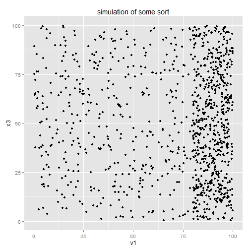
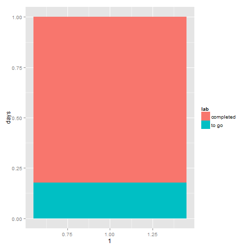
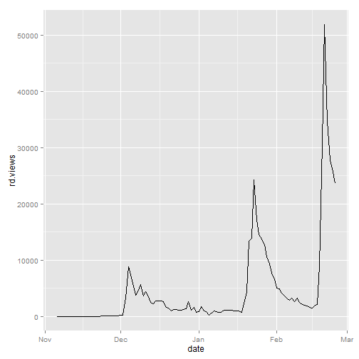

Web Scraping part 2: Digging in
========================================================
width: 1200
author: Rolf Fredheim and Aiora Zabala
date: University of Cambridge
font-family: 'Rockwell'
25/02/2014

Today we will:
========================================================

- Become good at writing bad* functions
- Learn how to access information in web-pages (HTML, XML, etc)

Get the docs:
http://fredheir.github.io/WebScraping/Lecture2/p2.html

https://raw.github.com/fredheir/WebScraping/master/Lecture2/p2.Rpres

http://fredheir.github.io/WebScraping/Lecture2/p2.R


<br>
<br>
<br>
<small> *mabye 'utilitarian', 'expedient', and 'functional' would be more accurate, if more pompous descriptions of this practice</small>

Digital data collection
=======================

- Devise a means of accessing data
- Retrieve that data
- tabulate and store the data

Last week step two involved JSON. 

Today we work with HTML. 

Steps 1 and 3 do not change the same

Revisiting the programming basics
================
type:section

Good functions
========================================================

What makes a function good?
- Clear name
- Instructions to user
- Short
- Performs a single task
- Is efficient
- Can handle errors
- Is predictable
- Does not use **global variables** (someone explain?)

Bad functions
========================================================

... break the rules/ guidelines above. But they can be useful to:
- hide a script behind a function
- get overview
- move on to the next task
- don't worry about methods and error handling: simplifies the process

If writing functions for your own use, it's ok* to write bad functions. 

<small>*But basic notes throughout the code reminding yourself what you did will be invaluable</small>

Revision
============
What is a variable?

What are they for?


Variables
=================
type:sq
Two main purposes:

quicker to write

```r
uni= "The University of Cambridge"
uni
```

```
[1] "The University of Cambridge"
```

***
quicker to change the code. It is good practice to declare variables near the start of your code

Paying tax:
9400 tax free

```r
(20000-9440)*20/100
```

```
[1] 2112
```

```r
#OR:
wage=20000
taxFree=9400
rate=20
(wage-taxFree)*rate/100
```

```
[1] 2120
```


Functions without variables
================


```r
printName <- function(){
  print ("My name is Rolf Fredheim")
}

printName()
```

```
[1] "My name is Rolf Fredheim"
```


This is a useless function. But sometimes, if we have many lines of code requiring no particular input, it can be useful to file them away like this.

e.g. for simulations
============

```r
sillySimulation <- function(){
x1 <- runif(500,80,100)
x2 <- runif(500,0,100)
v1 <- c(x1,x2)

x3 <- runif(1000,0,100)

df <- data.frame(v1,x3)
require(ggplot2)

print(ggplot(df, aes(v1,x3))+geom_point()+ggtitle("simulation of some sort"))
}
```


=====
Just as this slide hides the code on the previous slide, so the function hides the underlying code. 

```r
sillySimulation()
```

 


Inserting variables
=========
Let's hammer home how to use variables

what variables could we add to the function below?

```r
desperateTimes <- function(){
  print(paste0("Rolf is struggling to finish his PhD on time. Time remaining: 6 months"))
}
```


Name
===========


```r
desperateTimes <- function(name){
  print(paste0(name ," is struggling to finish his PhD on time. Time remaining: 6 months"))
}
desperateTimes(name="Tom")
```

```
[1] "Tom is struggling to finish his PhD on time. Time remaining: 6 months"
```


Gender
===========
type:sq
we specify a default value

```r
desperateTimes <- function(name,gender="m"){
  if(gender=="m"){
    pronoun="his"
  }else{
    pronoun="her"
  }
  
  print(paste0(name ," is struggling to finish ",pronoun," PhD on time. Time remaining: 6 months"))
}
desperateTimes(name="Tanya",gender="f")
```

```
[1] "Tanya is struggling to finish her PhD on time. Time remaining: 6 months"
```

Is this a good function? Why (not)?

degree
==============

```r
desperateTimes <- function(name,gender="m",degree){
  if(gender=="m"){
    pronoun="his"
  }else{
    pronoun="her"
  }
  
  print(paste0(name ," is struggling to finish ",pronoun," ",degree," on time. Time remaining: 6 months"))
}
desperateTimes(name="Rolf",gender="m","Mphil")
```

```
[1] "Rolf is struggling to finish his Mphil on time. Time remaining: 6 months"
```


Days til deadline
============
type:sq1

```r
require(lubridate)
require(ggplot2)
deadline=as.Date("2014-09-01")
daysLeft <- deadline-Sys.Date()
totDays <- deadline-as.Date("2011-10-01")
print(daysLeft)
```

```
Time difference of 188 days
```

```r
print(paste0("Rolf is struggling to finish his PhD on time. Days remaining: ", as.numeric(daysLeft)))
```

```
[1] "Rolf is struggling to finish his PhD on time. Days remaining: 188"
```

part2
==========
type:sq

```r
print(paste0("Percentage to go: ",round(as.numeric(daysLeft)/as.numeric(totDays)*100)))
```

```
[1] "Percentage to go: 18"
```

```r
df <- data.frame(days=c(daysLeft,totDays-daysLeft),lab=c("to go","completed"))
ggplot(df,aes(1,days,fill=lab))+geom_bar(stat="identity",position="fill")
```

 


===========
type:sq1

We could put all this code in a function, and forget about it

```r
timeToWorry <- function(){
  require(lubridate)
  deadline=as.Date("2014-09-01")
  daysLeft <- deadline-Sys.Date()
  totDays <- deadline-as.Date("2011-10-01")
  print(daysLeft)
  print(paste0("Rolf is struggling to finish his PhD on time. Days remaining: ", as.numeric(daysLeft)))
  print(paste0("Percentage to go: ",round(as.numeric(daysLeft)/as.numeric(totDays)*100)))
  df <- data.frame(days=c(daysLeft,totDays-daysLeft),lab=c("to go","completed"))
  ggplot(df,aes(1,days,fill=lab))+geom_bar(stat="identity",position="fill")
}
```


File it away until in need of a reminder
======

```r
timeToWorry()
```

```
Time difference of 188 days
[1] "Rolf is struggling to finish his PhD on time. Days remaining: 188"
[1] "Percentage to go: 18"
```

 


Finishing up last week's material
=============================
type:section


What does this have to do with webscraping?
============
Bad functions like this will help us to break the task into bitesize chunks

Rather than working with long unruly scripts, we write a little script that works, identify any necessary variables, and file it away. A typical structure might be:

- Load packages, set working directory
- Download one example
- Extract the necessary information
- Store the information
- Repeat.

-> either by looping, or by completing one step at a time


Last week's code
=================
type:sq
example and explanation

downloading data
Check the code is correct

```r
require(rjson)
url <-  "http://stats.grok.se/json/en/201201/web_scraping"
raw.data <- readLines(url, warn="F") 
rd  <- fromJSON(raw.data)
rd.views <- rd$daily_views 
rd.views <- unlist(rd.views)
rd <- as.data.frame(rd.views)
rd$date <- rownames(rd)
rownames(rd) <- NULL
rd
```

```
   rd.views       date
1       283 2012-01-01
2       573 2012-01-02
3       578 2012-01-03
4       666 2012-01-04
5       673 2012-01-05
6       626 2012-01-06
7       360 2012-01-07
8       430 2012-01-08
9       747 2012-01-09
10      771 2012-01-24
11      758 2012-01-25
12      458 2012-01-22
13      673 2012-01-23
14      739 2012-01-20
15      536 2012-01-21
16      730 2012-01-17
17      669 2012-01-16
18      568 2012-01-15
19      439 2012-01-14
20      742 2012-01-13
21      710 2012-01-12
22      800 2012-01-11
23      716 2012-01-10
24      500 2012-01-29
25      753 2012-01-31
26      838 2012-01-30
27      726 2012-01-19
28      734 2012-01-18
29      739 2012-01-26
30      738 2012-01-27
31      490 2012-01-28
```


Turn it into a function
========================
type:sq
"url" is the only thing that changes. Thus we have one variable
At the end we "return" the data to the user

```r
getData <- function(url){
  require(rjson)
  raw.data <- readLines(url, warn="F") 
  rd  <- fromJSON(raw.data)
  rd.views <- rd$daily_views 
  rd.views <- unlist(rd.views)
  rd <- as.data.frame(rd.views)
  rd$date <- rownames(rd)
  rownames(rd) <- NULL
  rd$date <- as.Date(rd$date)
  return(rd)
}
```

Now we can forget about *how* we download data, after checking the code works:
getData("http://stats.grok.se/json/en/201201/web_scraping")

============
The script and the function achieve exactly the same thing.

But: compressing the code to a single function is good to relieve the brain, and to de-clutter your code

Creating the URLS
=========
type:sq1

```r
getUrls <- function(y1,y2,term){
  root="http://stats.grok.se/json/en/"
    urls <- NULL
    for (year in y1:y2){
      for (month in 1:9){
        urls <- c(urls,(paste(root,year,0,month,"/",term,sep="")))
    	}
    
    	for (month in 10:12){
      	urls <- c(urls,(paste(root,year,month,"/",term,sep="")))
    	}
    }
    return(urls)
}
```


Put it together
======
type:sq2

```r
#create some URLS
urls <- getUrls(y1=2013,y2=2014,"Euromaidan")

#get data for each of them and store that data
results=NULL
for (url in urls){
  results <- rbind(results,getData(url))
}
head(results)
```

```
  rd.views       date
1        0 2013-01-12
2        0 2013-01-13
3        0 2013-01-10
4        0 2013-01-11
5        0 2013-01-16
6        0 2013-01-17
```

Inspect the data,
visualise it
***

```r
ggplot(tail(results,100),aes(date,rd.views))+geom_line()
```

 


OK, lets move on
=============
type:section

- HTML
- XPath
- CSS and attributes


Getting to know HTML structure
==============================

http://en.wikipedia.org/wiki/Euromaidan

Let's look at this webpage

- Headings
- Images
- links
- references
- tables

To look at the code (in Google Chrome), right-click somewhere on the page and select 'inspect element'

Tree-structure (parents, siblings)

Back to Wikipedia
====================
HTML tags.

They come in pairs and are surrounded by these guys:
<>

e.g. a heading might look like this:

\<h1\>MY HEADING\</h1\>
<h1>MY HEADING</h1>

Which others do you know or can you find?

HTML tags
======================

- \<html>: starts html code
- \<head> : contains meta data etc
- \<script> : e.g. javascript to be loaded
- \<style> : css code
- \<meta> : denotes document properties, e.g. author, keywords
- \<title> : 
- \<body> : 

HTML tags2
======================

- \<div>, \<span> :these are used to break up a document into sections and boxes
- \<h1>,\<h2>,\<h3>,\<h4>,\<h5> Different levels of heading
- \<p> : paragraph
- \<br> : line break
- and others: \<a>, \<ul>, \<tbody>, \<th>, \<td>, \<ul>, \<ul>, 


Principles of scraping
=============
- Identify the tag
- Download the web-page
- Extract content matching the tag
- Save the content
- Optional: repeat

Download the web page
===============
type:sq
XML Parser: 
>Parses an XML or HTML file or string containing XML/HTML content, and generates an R structure representing the XML/HTML tree. 


```r
require(RCurl)
require(XML)

url <- "http://en.wikipedia.org/wiki/Euromaidan"
SOURCE <-  getURL(url,encoding="UTF-8") #Download the page
#this is a very very long line. Let's not print it. Instead:
substring (SOURCE,1,200)
```

```
[1] "<!DOCTYPE html><html lang=\"en\" dir=\"ltr\" class=\"client-nojs\"><head><meta charset=\"UTF-8\" /><title>Euromaidan - Wikipedia, the free encyclopedia</title> <meta http-equiv=\"X-UA-Compatible\" content=\"IE=E"
```

```r
PARSED <- htmlParse(SOURCE) #Format the html code d
```


Accessing HTML elements in R
========
type:sq

Reading: 
http://www.w3schools.com/xpath/xpath_intro.asp

we can use XPath expressions to extract elements from HTML


```r
xpathSApply(PARSED, "//h1")
```

```
[[1]]
<h1 id="firstHeading" class="firstHeading" lang="en">
  <span dir="auto">Euromaidan</span>
</h1> 
```


Not so pretty. But! Specifying xmlValue strips away the surrounding code and returns only the content of the tag


```r
xpathSApply(PARSED, "//h1",xmlValue)
```

```
[1] "Euromaidan"
```


Digging deeper
=====================
What about other headings?


```r
xpathSApply(PARSED, "//h3",xmlValue)
```

```
 [1] "Name[edit]"                                                                    
 [2] "Initial causes[edit]"                                                          
 [3] "Public opinion about Euromaidan[edit]"                                         
 [4] "Public opinion about joining the EU[edit]"                                     
 [5] "Comparison with the Orange Revolution[edit]"                                   
 [6] "Escalation to Violence[edit]"                                                  
 [7] "Riots in Kiev[edit]"                                                           
 [8] "Protests across Ukraine[edit]"                                                 
 [9] "Protests outside Ukraine[edit]"                                                
[10] "Pro-government rallies[edit]"                                                  
[11] "\"Anti-maidans\"[edit]"                                                        
[12] "Automaidan[edit]"                                                              
[13] "Self-defense groups[edit]"                                                     
[14] "Deaths[edit]"                                                                  
[15] "Press and medics injured by police attacks[edit]"                              
[16] "Support for Euromaidan in Ukraine[edit]"                                       
[17] "Popular opinion in Ukraine about Association Agreement during Euromaidan[edit]"
[18] "Political impact[edit]"                                                        
[19] "Economic impact[edit]"                                                         
[20] "Social impact[edit]"                                                           
[21] "Cultural impact[edit]"                                                         
[22] "Sport[edit]"                                                                   
[23] "Personal tools"                                                                
[24] "Namespaces"                                                                    
[25] "\n\t\t"                                                                          
[26] "Variants"                                                                      
[27] "Views"                                                                         
[28] "Actions"                                                                       
[29] "Search"                                                                        
[30] "Navigation"                                                                    
[31] "Interaction"                                                                   
[32] "Tools"                                                                         
[33] "Print/export"                                                                  
[34] "Languages"                                                                     
```


=========
and links

```r
length(xpathSApply(PARSED, "//a/@href"))
```

```
[1] 2777
```

there's loads of them. We need to be more selective


CSS and XPath
===============
type: sq
web-designers use Cascading Style Sheets to determine the way a webpage looks

Like variables: change the style, rather than the every item on a page

I use CSS for these slides, check out the code for this page

<strong>CSS allows us to make better selections, by latching onto tags</strong>

**Xpath allows us to move up and down the html tree structure**

CSS can be an html **attribute**

CSS example here


Get references
=======================
type:sq

Content of the references

```r
head(xpathSApply(PARSED, "//span[@class='citation news']",xmlValue))
```

```
[1] "\"EuroMaidan rallies in Ukraine – Nov. 21–23 coverage\". Kyiv Post. 25 November 2013."                                                                                                     
[2] "Snyder, Timothy (3 February 2014). \"Don't Let Putin Grab Ukraine\". New York Times. Retrieved 5 February 2014. \"The current crisis in Ukraine began because of Russian foreign policy.\""
[3] "Spolsky, Danylo. \"One minister's dark warning and the ray of hope\". Kyiv Post (editorial). Retrieved 27 November 2013."                                                                  
[4] "\"Ukrainian opposition uses polls to bolster cause\". Euronews. 13 December 2013."                                                                                                         
[5] "\"Ukrainian opposition calls for President Yanukovych's impeachment\". Interfax-Ukraine (Kyiv Post). 21 November 2013. Retrieved 27 November 2013."                                        
[6] "Herszenhorn, David M. (1 December 2013). \"Thousands of Protesters in Ukraine Demand Leader's Resignation\". The New York Times. Retrieved 2 December 2013."                               
```


Content of the references 

```r
head(xpathSApply(PARSED, "//span[@class='citation news']/a/@href"))
```

```
                                                                                                                   href 
                 "http://www.kyivpost.com/content/ukraine/euromaidan-rallies-in-ukraine-nov-21-23-coverage-332423.html" 
                                                                                                                   href 
                        "http://www.nytimes.com/2014/02/04/opinion/dont-let-putin-grab-ukraine.html?smid=tw-share&_r=0" 
                                                                                                                   href 
                     "http://www.kyivpost.com/opinion/op-ed/one-ministers-dark-warning-and-the-ray-of-hope-332521.html" 
                                                                                                                   href 
                                 "http://www.euronews.com/2013/12/13/ukrainian-opposition-uses-polls-to-bolster-cause/" 
                                                                                                                   href 
                                                                                                       "/wiki/Euronews" 
                                                                                                                   href 
"http://www.kyivpost.com/content/politics/ukrainian-opposition-calls-for-president-yanukovychs-impeachment-332241.html" 
```

***
Test that these work, using the function from last week


```r
links <- (xpathSApply(PARSED, "//span[@class='citation news']/a/@href"))
browseURL(links[1])
```


So if you wanted to, you could scrape these links in turn.

tree-structure is navigated a bit like that on your computer (c:/windows/system)

XPath
==================

Is a language for querying XML

Reading and examples: http://www.w3schools.com/xml/xml_xpath.asp

The element in quotes below is an *XPath expression*


```r
head(xpathSApply(PARSED, "//span[@class='citation news']/a/@href"))

```


Fundamental XPath Syntax
===============

- /      Select from the root
- //     Select anywhere in document
- @      Select attributes. Use in square brackets

In this example, we select all elements of 'span'
...Which have an **attribute** "class" of the value "citation news"
...then we select all links
...and return all attributes labeled "href" (the urls)


```r
head(xpathSApply(PARSED, "//span[@class='citation news']/a/@href"))
```


XPath2
============
type:sq1

Like in R, we use square brackets to make selections

What does this select?

```r
head(xpathSApply(PARSED, "//span[@class='citation news'][17]/a/@href"))
```

```
                                               href 
"http://interfax.com.ua/news/political/177921.html" 
```


Wildcards
======================
type:sq2

We can also use wildcards:

- * selects any node or tag
- @* selects any attribute (used to define nodes)

```r
(xpathSApply(PARSED, "//*[@class='citation news'][17]/a/@href"))
```

```
                                               href 
"http://interfax.com.ua/news/political/177921.html" 
```

```r
(xpathSApply(PARSED, "//span[@class='citation news'][17]/a/@*"))
```

```
                                                rel 
                                         "nofollow" 
                                              class 
                                    "external text" 
                                               href 
"http://interfax.com.ua/news/political/177921.html" 
```


XPath3
==================
You can use functions, e.g. for partial matches
-> useful if there are subtle variations within or between pages

```r
head(xpathSApply(PARSED, "//span[starts-with(@class,'citation')][17]/a/@href"))
head(xpathSApply(PARSED, "//span[contains(@class,'citation')][17]/a/@href"))
```


example syntax
[function(attribute,string)]


Examples
===============
type:section

BBC

Guardian


Example - BBC article
================
type:sq

```r
url <- "http://www.bbc.co.uk/news/world-europe-26333587"
SOURCE <-  getURL(url,encoding="UTF-8") # Specify encoding when dealing with non-latin characters
PARSED <- htmlParse(SOURCE)
(xpathSApply(PARSED, "//h1[@class='story-header']",xmlValue))
```

```
[1] "Ukraine crisis: Turchynov warns of 'separatism' risk"
```

```r
(xpathSApply(PARSED, "//span[@class='date']",xmlValue))
```

```
[1] "25 February 2014"
```

```r
#Meta field for better formatting
(xpathSApply(PARSED, "//meta[@name='OriginalPublicationDate']/@content"))
```

```
              content 
"2014/02/25 13:32:38" 
```


Make a scraper
===============


```r
bbcScraper <- function(url){
  SOURCE <-  getURL(url,encoding="UTF-8")
  PARSED <- htmlParse(SOURCE)
  title=(xpathSApply(PARSED, "//h1[@class='story-header']",xmlValue))
  date=as.character(xpathSApply(PARSED, "//meta[@name='OriginalPublicationDate']/@content"))
  return(c(title,date))
}
```


test It
============

```r
bbcScraper("http://www.bbc.co.uk/news/world-middle-east-26333533")
```

```
[1] "Syria crisis: A Palestinian plea from Yarmouk refugee camp"
[2] "2014/02/25 02:53:02"                                       
```

```r
bbcScraper("http://www.bbc.co.uk/sport/0/football/26332893")
```

```
[1] "England: Roy Hodgson may use psychologist for penalties"
```


Ah. A problem. Not all pages have meta fields

Adding exceptions
==============
type:sq2
As you build your scraper you will find the need to add multiple possible options.

Why is this?

```r
bbcScraper2 <- function(url){
  title=date=NA #Return empty values in case field not found
  SOURCE <-  getURL(url,encoding="UTF-8") 
  PARSED <- htmlParse(SOURCE)
  title=(xpathSApply(PARSED, "//h1[@class='story-header']",xmlValue))
  date=(xpathSApply(PARSED, "//meta[@name='OriginalPublicationDate']/@content"))
  if (is.null(date)){
    date=(xpathSApply(PARSED, "//span[@class='date']",xmlValue))
  }
  return(c(title,as.character(date)))
}
```


```r
bbcScraper2("http://www.bbc.co.uk/news/world-middle-east-26333533")
```

```
[1] "Syria crisis: A Palestinian plea from Yarmouk refugee camp"
[2] "2014/02/25 02:53:02"                                       
```

```r
bbcScraper2("http://www.bbc.co.uk/sport/0/football/26332893")
```

```
[1] "England: Roy Hodgson may use psychologist for penalties"
[2] "25 February 2014"                                       
```


Guardian
=======================
type:sq 2
start with the bbc scraper as a base, then change the necessary fields


```r
url <- "http://www.theguardian.com/commentisfree/2014/feb/25/how-much-cost-growers-bananas-68p-per-kilo"
  SOURCE <-  getURL(url,encoding="UTF-8")
  PARSED <- htmlParse(SOURCE)
  xpathSApply(PARSED, "//h1[contains(@itemprop,'headline')]",xmlValue)
```

```
[1] "Just how much does it cost growers to give us bananas at 68p per kilo?"
```

```r
  xpathSApply(PARSED, "//a[@class='contributor']",xmlValue)
```

```
[1] "Joanna Blythman"
```

```r
  xpathSApply(PARSED, "//time[@itemprop='datePublished']",xmlValue)
```

```
[1] "Tuesday 25 February 2014 08.00 GMT"
```

Guardian continued
===========
type:sq2


```r
  xpathSApply(PARSED, "//time[@itemprop='datePublished']/@datetime")
```

```
             datetime 
"2014-02-25T08:00GMT" 
```

```r
  xpathSApply(PARSED, "//a[@rel='tag']",xmlValue)
```

```
 [1] "Supermarkets"          "Food & drink industry"
 [3] "Retail industry"       "Food"                 
 [5] "Consumer affairs"      "Supermarkets"         
 [7] "Food & drink industry" "Retail industry"      
 [9] "Food"                  "Consumer affairs"     
```

```r
  unique(xpathSApply(PARSED, "//a[@rel='tag']",xmlValue))
```

```
[1] "Supermarkets"          "Food & drink industry" "Retail industry"      
[4] "Food"                  "Consumer affairs"     
```

```r
  xpathSApply(PARSED, "//div[@id='article-body-blocks']",xmlValue)
```

```
[1] "\n\t    Walk into Tesco or Asda today and you'll be able to buy a kilo of bananas for about 68p. Back in 2002 that same bunch would have cost £1.08 – yes, 59% more. Bananas are a glaring exception to the rule that food keeps getting more expensive. If banana price inflation had kept up with the pace of Mars bars, for instance, the fruit would cost £2.60 a kilo now.This is a uniquely British anomaly: in France, Italy and Germany, over the same period the retail price of bananas has increased by 10%, 3.9% and 7.2% respectively.In the crazy world of UK supermarket pricing, bananas have never been cheaper. We are now typically paying 20p for an English apple yet only 11p for a banana shipped from the other side of the world. Does this bargain deal smell rotten? It certainly ought to.For years, British supermarkets have used shamelessly cheap bananas as a key weapon in their price wars. They have demanded that their suppliers give them bananas at a price so unfeasibly low that they cannot possibly be grown in a decent, equitable way.The cheap bananas in UK supermarkets are typically grown on Latin American plantations that are owned by transnational fruit exporting companies, or their satellites. The natural landscape will have been flattened to allow for intensive banana cultivation stretching as far as the eye can see. These vast acreages are heavily treated with pesticides, usually by aerial spraying. This is why, in Latin America, the banana is often referred to as \"the chemical fruit\".The workers generally live either in lamentable shanty accommodation on site or are bused in great distances to work a long and punishing day. Paid piece rates, they have to work themselves into the ground to make a living wage.The scandalous conditions of workers in the banana industry have been thoroughly documented by British trade unions, the campaigning group Banana Link, and the Fairtrade Foundation, and laid before the top brass of British supermarkets. And yet it is fruits with this foul-tasting backstory that leading chains want us to buy.Faced with undeniable facts about the sheer despair entailed in the production of the cheap banana, Waitrose, the Co-op and Sainsbury's now source 100% Fairtrade bananas. But the other supermarket chains haven't followed suit. It is only Fairtrade – the system that guarantees growers a better, stable price and pays a premium for community projects – that is keeping small co-ops of banana growers in Latin America, and further afield, in business. In the Caribbean, for instance, distance to market, climate and topography all mean they could never compete on price with the plantation-grown crop.But although Fairtrade provides a model for a more ethical banana supply chain, the price-cutting activities of our biggest supermarkets are distorting the whole banana trade. Even Fairtrade bananas are being sold these days at the ludicrously low 68p a kilo, as a loss leader, because all bananas are now part of the ongoing price wars between chains.Of course, supermarkets don't suffer from loss-leading strategies – they simply jack up their margins on other foods to make up for any hit they take on bananas – but as all the value is wrung out of the banana supply market, you can be sure that faceless people in faraway places will be feeling the squeeze.Quite rightly, the Fairtrade Foundation is calling on the government to stop supermarket price-slashing on bananas, but hell will freeze over before that happens. This government, like its predecessors, turns a blind eye to all supermarket transgression providing our oligopolistic retailers maintain the necessary illusion of keeping prices down.Food riots usually occur when prices are too high. Perverse though it may be to campaign for prices to be raised, in the case of bananas it is the only humane and ethical response. We need a riot over banana pricing right now.\n    " 
```

```r
  xpathSApply(PARSED, "//div[@id='article-body-blocks']/p",xmlValue)
```

```
 [1] "Walk into Tesco or Asda today and you'll be able to buy a kilo of bananas for about 68p. Back in 2002 that same bunch would have cost £1.08 – yes, 59% more. Bananas are a glaring exception to the rule that food keeps getting more expensive. If banana price inflation had kept up with the pace of Mars bars, for instance, the fruit would cost £2.60 a kilo now."                                                                                                                                                                                                                                                
 [2] "This is a uniquely British anomaly: in France, Italy and Germany, over the same period the retail price of bananas has increased by 10%, 3.9% and 7.2% respectively."                                                                                                                                                                                                                                                                                                                                                                                                                                                   
 [3] "In the crazy world of UK supermarket pricing, bananas have never been cheaper. We are now typically paying 20p for an English apple yet only 11p for a banana shipped from the other side of the world. Does this bargain deal smell rotten? It certainly ought to."                                                                                                                                                                                                                                                                                                                                                    
 [4] "For years, British supermarkets have used shamelessly cheap bananas as a key weapon in their price wars. They have demanded that their suppliers give them bananas at a price so unfeasibly low that they cannot possibly be grown in a decent, equitable way."                                                                                                                                                                                                                                                                                                                                                         
 [5] "The cheap bananas in UK supermarkets are typically grown on Latin American plantations that are owned by transnational fruit exporting companies, or their satellites. The natural landscape will have been flattened to allow for intensive banana cultivation stretching as far as the eye can see. These vast acreages are heavily treated with pesticides, usually by aerial spraying. This is why, in Latin America, the banana is often referred to as \"the chemical fruit\"."                                                                                                                                   
 [6] "The workers generally live either in lamentable shanty accommodation on site or are bused in great distances to work a long and punishing day. Paid piece rates, they have to work themselves into the ground to make a living wage."                                                                                                                                                                                                                                                                                                                                                                                   
 [7] "The scandalous conditions of workers in the banana industry have been thoroughly documented by British trade unions, the campaigning group Banana Link, and the Fairtrade Foundation, and laid before the top brass of British supermarkets. And yet it is fruits with this foul-tasting backstory that leading chains want us to buy."                                                                                                                                                                                                                                                                                 
 [8] "Faced with undeniable facts about the sheer despair entailed in the production of the cheap banana, Waitrose, the Co-op and Sainsbury's now source 100% Fairtrade bananas. But the other supermarket chains haven't followed suit. It is only Fairtrade – the system that guarantees growers a better, stable price and pays a premium for community projects – that is keeping small co-ops of banana growers in Latin America, and further afield, in business. In the Caribbean, for instance, distance to market, climate and topography all mean they could never compete on price with the plantation-grown crop."
 [9] "But although Fairtrade provides a model for a more ethical banana supply chain, the price-cutting activities of our biggest supermarkets are distorting the whole banana trade. Even Fairtrade bananas are being sold these days at the ludicrously low 68p a kilo, as a loss leader, because all bananas are now part of the ongoing price wars between chains."                                                                                                                                                                                                                                                       
[10] "Of course, supermarkets don't suffer from loss-leading strategies – they simply jack up their margins on other foods to make up for any hit they take on bananas – but as all the value is wrung out of the banana supply market, you can be sure that faceless people in faraway places will be feeling the squeeze."                                                                                                                                                                                                                                                                                                  
[11] "Quite rightly, the Fairtrade Foundation is calling on the government to stop supermarket price-slashing on bananas, but hell will freeze over before that happens. This government, like its predecessors, turns a blind eye to all supermarket transgression providing our oligopolistic retailers maintain the necessary illusion of keeping prices down."                                                                                                                                                                                                                                                            
[12] "Food riots usually occur when prices are too high. Perverse though it may be to campaign for prices to be raised, in the case of bananas it is the only humane and ethical response. We need a riot over banana pricing right now."                                                                                                                                                                                                                                                                                                                                                                                     
```


Guardian scraper
======================
type:sq

```r
guardianScraper <- function(url){
  SOURCE <-  getURL(url,encoding="UTF-8") # Specify encoding when dealing with non-latin characters
  PARSED <- htmlParse(SOURCE)
  title <- xpathSApply(PARSED, "//h1[contains(@itemprop,'headline')]",xmlValue)
  author <- xpathSApply(PARSED, "//time[@itemprop='datePublished']",xmlValue)
  time  <- xpathSApply(PARSED, "//time[@itemprop='datePublished']/@datetime")
  tags <- unique(xpathSApply(PARSED, "//a[@rel='tag']",xmlValue))
  text <- xpathSApply(PARSED, "//div[@id='article-body-blocks']/p",xmlValue)
  return(list(title=title,
              author=author,
              time=time,
              tags=paste(tags,collapse="|")
              ,text=paste(text,collapse="|")))
}
```


Using the scraper
====================
type:sq1

```r
a <- guardianScraper(url)
a["title"]
```

```
$title
[1] "Just how much does it cost growers to give us bananas at 68p per kilo?"
```

```r
a[["title"]]
```

```
[1] "Just how much does it cost growers to give us bananas at 68p per kilo?"
```

```r
a[["tags"]]
```

```
[1] "Supermarkets|Food & drink industry|Retail industry|Food|Consumer affairs"
```


Storing the data
=====================
type:sq
Small scale operations: an R data.frame, using rbind

Problems:
- copying the table
- data frames not good for storing text

XML

SQLite database

Cons: Less intuitive setup and access
Pros: much faster. Archive text and forget about it. Use SOLR to index and get fast retrieval. 

BUT: You can learn enough SQL in a few hours. And R has excellent packages for saving and retrieving information from SQL. 


Example with dataframe. 
======================
type:sq1
Get some URLs, e.g. top articles of the day

```r
url <- "http://www.theguardian.com/uk"
  SOURCE <-  getURL(url,encoding="UTF-8") 
  PARSED <- htmlParse(SOURCE)
  urls <- xpathSApply(PARSED, "//div[@class='tabs-container']//*/@href")

#This is a bit tricky, apologies. There may be a better way
d <- lapply(urls,guardianScraper)
data <- data.frame(matrix(unlist(d),nrow=2,byrow=T))
colnames(data) <- c("title","author","time","tags","text")
as.character(data$tags)
```

```
[1] "Rebecca Adlington|Gender|Newspapers|Women"
[2] "2014-02-25T13:48GMT"                      
```


Accessing this data later on
====================
the data.table packes is very useful for this, but it takes a bit of learning.


```r
require(stringr)
#return title of texts mentioning Chelsea
data[grep("Chelsea",data$tags),"title"]
```

```
factor(0)
Levels:  Dear Rebecca Adlington, they're the ugly ones
```

```r
#return tags of texts mentioning Chelsea
unlist(str_split(data[grep("Chelsea",data$tags),"tags"],"\\|"))
```

```
NULL
```


Practice time
================
type: section

write a scraper for:
- http://www.mirror.co.uk/
- http://www.telegraph.co.uk/
- http://www.independent.co.uk

Your own interests here?

Advanced stuff: comments
=======================
type:sq

Harder - find the iframe

```r
url <- "http://discussion.theguardian.com/discussion/p/3n34d"
  SOURCE <-  getURL(url,encoding="UTF-8") # Specify encoding when dealing with non-latin characters
  PARSED <- htmlParse(SOURCE)
  xpathSApply(PARSED, "//div[@class='d2-body'][1]",xmlValue)
```

```
[1] "would have been nice if you had noticed that it was the Co-op movement that drove Fairtrade for bananas since the year 2000, not just one of a list of supermarkets \"now\" providing fairtrade bananas"
```

```r
  xpathSApply(PARSED, "//a[@class='d2-username']",xmlValue)
```

```
  [1] "sezme"                "joe5000"              "conanthebarbarian"   
  [4] "zacmcd"               "_jhfta_"              "conanthebarbarian"   
  [7] "Ozjock"               "eminexion"            "Orthus"              
 [10] "aestite"              "GoldMoney"            "conanthebarbarian"   
 [13] "Stiles"               "whatithink"           "psychopathiclovelord"
 [16] "succulentpork"        "whatithink"           "whatithink"          
 [19] "Zooogi"               "whatithink"           "CJBill"              
 [22] "CJBill"               "whatithink"           "TheGreatRonRafferty" 
 [25] "CJBill"               "CJBill"               "katiewm"             
 [28] "MartinaWeitsch"       "monkofgreatrenown"    "groovemaneuvers"     
 [31] "iruka"                "succulentpork"        "robashw"             
 [34] "KelvinYearwood"       "katiewm"              "succulentpork"       
 [37] "Orthus"               "iruka"                "Jester11"            
 [40] "NSAhunter"            "iruka"                "psychopathiclovelord"
 [43] "external"             "richmanchester"       "bifess"              
 [46] "GranniesWaffles666"   "Ozjock"               "external"            
 [49] "external"             "Flossiethefloozie"    "Tiberman"            
 [52] "LabanTall"            "richmanchester"       "ABasu"               
 [55] "Zooogi"               "greygran"             "Leopold1904"         
 [58] "norgate"              "HemingfieldTwit"      "external"            
 [61] "Orthus"               "S Stigson"            "LouSnickers"         
 [64] "external"             "gohumanity"           "kennyboy"            
 [67] "nocausetoaddopt"      "billysbar"            "nocausetoaddopt"     
 [70] "bifess"               "OutOfOptions"         "_jhfta_"             
 [73] "ClemAttleesSpirit"    "nocausetoaddopt"      "LightBeam1"          
 [76] "StVitusGerulaitis"    "CJBill"               "ClemAttleesSpirit"   
 [79] "OldStyleBlackboard"   "pangar"               "ManofConstantSorrow" 
 [82] "Sidfishes"            "ClemAttleesSpirit"    "rollercoasteryouth"  
 [85] "CJBill"               "rollercoasteryouth"   "rollercoasteryouth"  
 [88] "CJBill"               "AJQDuggan"            "sabelmouse"          
 [91] "1nn1t"                "markahoy"             "pangar"              
 [94] "gablody"              "GranniesWaffles666"   "Existangst"          
 [97] "Emjaysee"             "mrwicksy"             "notndmushroom"       
[100] "Lawriejones1"         "LouSnickers"          "pangar"              
[103] "pangar"               "StVitusGerulaitis"    "NSAhunter"           
[106] "LouSnickers"          "ABasu"                "PandaMonium13"       
[109] "gablody"              "gablody"              "UltraNationalist"    
[112] "UltraNationalist"     "OzzieEng"             "Margarito"           
[115] "aestite"              "PearOfAnguish"        "furiouspurpose"      
[118] "PearOfAnguish"        "furiouspurpose"       "PearOfAnguish"       
[121] "EllsBells"            "backtothepoint"       "Pluto100"            
[124] "backtothepoint"       "Pluto100"             "DickSpanner"         
[127] "pangar"               "ManofConstantSorrow"  "GranniesWaffles666"  
[130] "WarwickC"             "Pluto100"             "Orthus"              
[133] "WarwickC"             "furiouspurpose"       "seekerz"             
[136] "pangar"               "GranniesWaffles666"   "notndmushroom"       
[139] "groovemaneuvers"      "GranniesWaffles666"   "GranniesWaffles666"  
[142] "pangar"               "huzar30"              "thesensiblechoice"   
[145] "nihilist"             "seekerz"              "freespeechoneeach"   
[148] "nihilist"             "loosemore"            "rightwinggit"        
[151] "rightwinggit"        
```


Comments2
================
type:sq2
So, we need a way to find the iframe. But the iframe is loaded by a script. 

```r
url <- "http://www.theguardian.com/commentisfree/2014/feb/25/how-much-cost-growers-bananas-68p-per-kilo"
  SOURCE <-  getURL(url,encoding="UTF-8")
  PARSED <- htmlParse(SOURCE)
  links <- xpathSApply(PARSED, "//@href")
  shortUrl <- links[grep("//gu\\.",links)][1]
  require(stringr)
  temp <- unlist(str_split(shortUrl,"/"))
  target <- temp[length(temp)]

  discussionURL <- paste0("http://discussion.theguardian.com/discussion/p/",target)
  SOURCE <-  getURL(discussionURL,encoding="UTF-8") 
  PARSED <- htmlParse(SOURCE)
  xpathSApply(PARSED, "//a[@class='d2-username']",xmlValue)
```

```
  [1] "sezme"                "joe5000"              "conanthebarbarian"   
  [4] "zacmcd"               "_jhfta_"              "conanthebarbarian"   
  [7] "Ozjock"               "eminexion"            "Orthus"              
 [10] "aestite"              "GoldMoney"            "conanthebarbarian"   
 [13] "Stiles"               "whatithink"           "psychopathiclovelord"
 [16] "succulentpork"        "whatithink"           "whatithink"          
 [19] "Zooogi"               "whatithink"           "CJBill"              
 [22] "CJBill"               "whatithink"           "TheGreatRonRafferty" 
 [25] "CJBill"               "CJBill"               "katiewm"             
 [28] "MartinaWeitsch"       "monkofgreatrenown"    "groovemaneuvers"     
 [31] "iruka"                "succulentpork"        "robashw"             
 [34] "KelvinYearwood"       "katiewm"              "succulentpork"       
 [37] "Orthus"               "iruka"                "Jester11"            
 [40] "NSAhunter"            "iruka"                "psychopathiclovelord"
 [43] "external"             "richmanchester"       "bifess"              
 [46] "GranniesWaffles666"   "Ozjock"               "external"            
 [49] "external"             "Flossiethefloozie"    "Tiberman"            
 [52] "LabanTall"            "richmanchester"       "ABasu"               
 [55] "Zooogi"               "greygran"             "Leopold1904"         
 [58] "norgate"              "HemingfieldTwit"      "external"            
 [61] "Orthus"               "S Stigson"            "LouSnickers"         
 [64] "external"             "gohumanity"           "kennyboy"            
 [67] "nocausetoaddopt"      "billysbar"            "nocausetoaddopt"     
 [70] "bifess"               "OutOfOptions"         "_jhfta_"             
 [73] "ClemAttleesSpirit"    "nocausetoaddopt"      "LightBeam1"          
 [76] "StVitusGerulaitis"    "CJBill"               "ClemAttleesSpirit"   
 [79] "OldStyleBlackboard"   "pangar"               "ManofConstantSorrow" 
 [82] "Sidfishes"            "ClemAttleesSpirit"    "rollercoasteryouth"  
 [85] "CJBill"               "rollercoasteryouth"   "rollercoasteryouth"  
 [88] "CJBill"               "AJQDuggan"            "sabelmouse"          
 [91] "1nn1t"                "markahoy"             "pangar"              
 [94] "gablody"              "GranniesWaffles666"   "Existangst"          
 [97] "Emjaysee"             "mrwicksy"             "notndmushroom"       
[100] "Lawriejones1"         "LouSnickers"          "pangar"              
[103] "pangar"               "StVitusGerulaitis"    "NSAhunter"           
[106] "LouSnickers"          "ABasu"                "PandaMonium13"       
[109] "gablody"              "gablody"              "UltraNationalist"    
[112] "UltraNationalist"     "OzzieEng"             "Margarito"           
[115] "aestite"              "PearOfAnguish"        "furiouspurpose"      
[118] "PearOfAnguish"        "furiouspurpose"       "PearOfAnguish"       
[121] "EllsBells"            "backtothepoint"       "Pluto100"            
[124] "backtothepoint"       "Pluto100"             "DickSpanner"         
[127] "pangar"               "ManofConstantSorrow"  "GranniesWaffles666"  
[130] "WarwickC"             "Pluto100"             "Orthus"              
[133] "WarwickC"             "furiouspurpose"       "seekerz"             
[136] "pangar"               "GranniesWaffles666"   "notndmushroom"       
[139] "groovemaneuvers"      "GranniesWaffles666"   "GranniesWaffles666"  
[142] "pangar"               "huzar30"              "thesensiblechoice"   
[145] "nihilist"             "seekerz"              "freespeechoneeach"   
[148] "nihilist"             "loosemore"            "rightwinggit"        
[151] "rightwinggit"        
```


Why might this be useful?
===============
Studying reception (e.g. sentiment)
Assessing how controversial a subject is (does anyone care enough to comment)

Who always comments?
- Detecting spammers or paid commenters (e.g. articles about Russia)


Solutions (1: Mirror)
==================
type:sq1

Can you turn these into scraper functions?
Mirror

```r
#MIRROR
url <- "http://www.mirror.co.uk/news/world-news/oscar-pistorius-trial-murder-reeva-3181393"
SOURCE <-  getURL(url,encoding="UTF-8") 
PARSED <- htmlParse(SOURCE)
title <- xpathSApply(PARSED, "//h1",xmlValue)
author <- xpathSApply(PARSED, "//li[@class='author']",xmlValue)
time  <- xpathSApply(PARSED, "//time[@itemprop='datePublished']/@datetime")
```


Telegraph
============
type:sq1


```r
#Telegraph
url <- "http://www.telegraph.co.uk/news/uknews/terrorism-in-the-uk/10659904/Former-Guantanamo-detainee-Moazzam-Begg-one-of-four-arrested-on-suspicion-of-terrorism.html"
SOURCE <-  getURL(url,encoding="UTF-8") 
PARSED <- htmlParse(SOURCE)
title <- xpathSApply(PARSED, "//h1[@itemprop='headline name']",xmlValue)
author <- xpathSApply(PARSED, "//p[@class='bylineBody']",xmlValue)
time  <- xpathSApply(PARSED, "//p[@class='publishedDate']",xmlValue)
```


Independent
==============
type:sq1

```r
#Independent
url <- "http://www.independent.co.uk/news/world/asia/leopard-on-the-loose-puts-indian-city-of-meerut-on-lockdown-9151273.html"
SOURCE <-  getURL(url,encoding="UTF-8")
PARSED <- htmlParse(SOURCE)
title <- xpathSApply(PARSED, "//h1",xmlValue)
author <- xpathSApply(PARSED, "//span[@class='authorName']",xmlValue)
time  <- xpathSApply(PARSED, "//p[@class='dateline']",xmlValue)
```


Finally
============
What shall we do next week?

More work on this? 

Work with APIs?

Look at gathering links for scraping, downloading files, etc?


<!-- CSS formatting used in these slides -->

<style>.s1 .reveal .state-background {
  background: #E0E0FF;
} 

.sq1 .reveal section code {
  font-size:145%;
}
.sq1 .reveal section p {
  font-size:100%;
}


.sq .reveal section code {
  font-size:125%;
}
.sq .reveal section p {
  font-size:85%;
}


.sq2 .reveal section code {
	font-size:100%;
}
.sq2 .reveal section p {
  font-size:70%;
}
.reveal blockquote {
  display: block;
  position: relative;
  width: 100%;
  margin: 5px auto;
  padding: 5px;

  font-style: normal;
  background: #C6D7DC;
  border: 1px solid #C6D7DC;
  box-shadow: none;
}

.reveal pre {   
  margin-top: 0;
  max-width: 100%;
  width: 100%;
  border: 1px solid #ccc;
  white-space: pre-wrap;
  margin-bottom: 1em; 
}

.reveal pre code {
/*  display: block; padding: 0.5em;
*/  font-size: 1.6em;
  line-height: 1.1em;
  background-color: white;
  overflow: visible;
  max-height: none;
  word-wrap: normal;
}

.reveal section centered {
	text-align: center;
   border: none;
}
</style>
