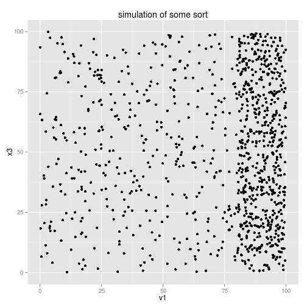
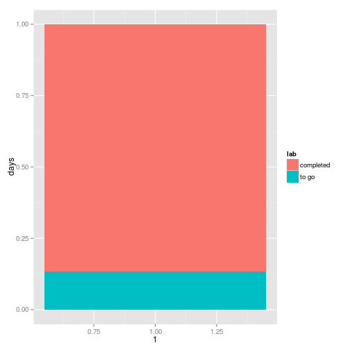

Digital Data Collection - programming extras
========================================================
width: 1200
author: Rolf Fredheim and Yulia Shenderovich
date: University of Cambridge
font-family: 'Rockwell'
css:style.css

24/02/2015

Variables
==================================

```r
uni  <-  "The University of Cambridge"
uni
```

```
[1] "The University of Cambridge"
```


Paying tax:
======

```r
#9400 tax free
(20000-9440)*20/100
```

```
[1] 2112
```

```r
#OR:
wage <- 20000
taxFree <- 9400
rate <- 20
(wage-taxFree)*rate/100
```

```
[1] 2120
```


Briefly about functions
===============
type:sq

```r
plusOne <- function(x){ 
  	return(x+1)			
	}

plusOne2 <- function(num){ 
		return(num+1)			
	}
```

<small> 
- Curly brackets {} include the code to be executed
- Normal brackets () contain a list of variables</small>

****

```r
	plusOne(8)
```

```
[1] 9
```

```r
	plusOne2(10)
```

```
[1] 11
```

```r
  plusOne2(num=5)
```

```
[1] 6
```

```r
  #plusOne2(wrongVar=2)
```


Simple loops
=============

```r
for (number in 1:5){
	print (number)
}
```

```
[1] 1
[1] 2
[1] 3
[1] 4
[1] 5
```

Looping over functions
========================
type:sq

```r
a <- c(1,2,3,4,5)
for (value in a){
	print (
		plusOne(value)
	)
}
```

```
[1] 2
[1] 3
[1] 4
[1] 5
[1] 6
```
***

```r
listOfNumbers <- c(1,2,3,4,5)
for (number in listOfNumbers){
	print (
		number+1
	)
}
```

```
[1] 2
[1] 3
[1] 4
[1] 5
[1] 6
```

More loops
========================
type:sq

```r
a <- c(1,2,3,4,5)
a[1] #The first number in the vector
```

```
[1] 1
```

```r
a[4] #The fourth number in the vector
```

```
[1] 4
```
***

```r
for (i in 1:length(a)){
	print (
		plusOne(a[i])
	)
}
```

```
[1] 2
[1] 3
[1] 4
[1] 5
[1] 6
```


Functions without variables
================


```r
printName <- function(){
  print ("My name is Rolf Fredheim")
}

printName()
```

```
[1] "My name is Rolf Fredheim"
```

This is a useless function. But sometimes, if we have many lines of code requiring no particular input, it can be useful to file them away like this.

e.g. for simulations
============

```r
sillySimulation <- function(){
x1 <- runif(500,80,100)
x2 <- runif(500,0,100)
v1 <- c(x1,x2)

x3 <- runif(1000,0,100)

df <- data.frame(v1,x3)
require(ggplot2)

print(ggplot(df, aes(v1,x3))+geom_point()+ggtitle("simulation of some sort"))
}
```


=====
Just as this slide hides the code on the previous slide, so the function hides the underlying code. 

```r
sillySimulation()
```

 

Inserting variables
=========
Let's hammer home how to use variables

what variables could we add to the function below?

```r
desperateTimes <- function(){
  print(paste0("Rolf is struggling to finish his PhD on time. Time remaining: 6 months"))
}
```


Name
===========


```r
desperateTimes <- function(name){
  print(paste0(name ," is struggling to finish his PhD on time. Time remaining: 6 months"))
}
desperateTimes(name="Tom")
```

```
[1] "Tom is struggling to finish his PhD on time. Time remaining: 6 months"
```

Gender
===========
type:sq
we specify a default value

```r
desperateTimes <- function(name,gender="m"){
  if(gender=="m"){
    pronoun="his"
  }else{
    pronoun="her"
  }
  
  print(paste0(name ," is struggling to finish ",pronoun," PhD on time. Time remaining: 6 months"))
}
desperateTimes(name="Tanya",gender="f")
```

```
[1] "Tanya is struggling to finish her PhD on time. Time remaining: 6 months"
```
Is this a good function? Why (not)?

degree
==============

```r
desperateTimes <- function(name,gender="m",degree){
  if(gender=="m"){
    pronoun="his"
  }else{
    pronoun="her"
  }
  
  print(paste0(name ," is struggling to finish ",pronoun," ",degree," on time. Time remaining: 6 months"))
}
desperateTimes(name="Rolf",gender="m","Mphil")
```

```
[1] "Rolf is struggling to finish his Mphil on time. Time remaining: 6 months"
```


Days til deadline
============
type:sq1

```r
require(lubridate)
require(ggplot2)
deadline=as.Date("2015-09-01")
daysLeft <- deadline-Sys.Date()
totDays <- deadline-as.Date("2011-10-01")
print(daysLeft)
```

```
Time difference of 190 days
```

```r
print(paste0("Rolf is struggling to finish his PhD on time. Days remaining: ", as.numeric(daysLeft)))
```

```
[1] "Rolf is struggling to finish his PhD on time. Days remaining: 190"
```
part2
==========
type:sq

```r
print(paste0("Percentage to go: ",round(as.numeric(daysLeft)/as.numeric(totDays)*100)))
```

```
[1] "Percentage to go: 13"
```

```r
df <- data.frame(days=c(daysLeft,totDays-daysLeft),lab=c("to go","completed"))
ggplot(df,aes(1,days,fill=lab))+geom_bar(stat="identity",position="fill")
```

 


===========
type:sq1

We could put all this code in a function, and forget about it

```r
timeToWorry <- function(){
  require(lubridate)
  deadline=as.Date("2015-09-01")
  daysLeft <- deadline-Sys.Date()
  totDays <- deadline-as.Date("2011-10-01")
  print(daysLeft)
  print(paste0("Rolf is struggling to finish his PhD on time. Days remaining: ", as.numeric(daysLeft)))
  print(paste0("Percentage to go: ",round(as.numeric(daysLeft)/as.numeric(totDays)*100)))
  df <- data.frame(days=c(daysLeft,totDays-daysLeft),lab=c("to go","completed"))
  ggplot(df,aes(1,days,fill=lab))+geom_bar(stat="identity",position="fill")
}
```

File it away until in need of a reminder
======

```r
timeToWorry()
```

```
Time difference of 190 days
[1] "Rolf is struggling to finish his PhD on time. Days remaining: 190"
[1] "Percentage to go: 13"
```

 
